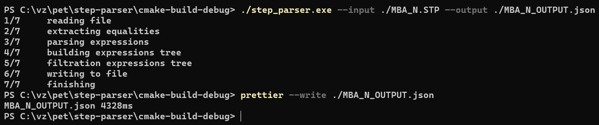
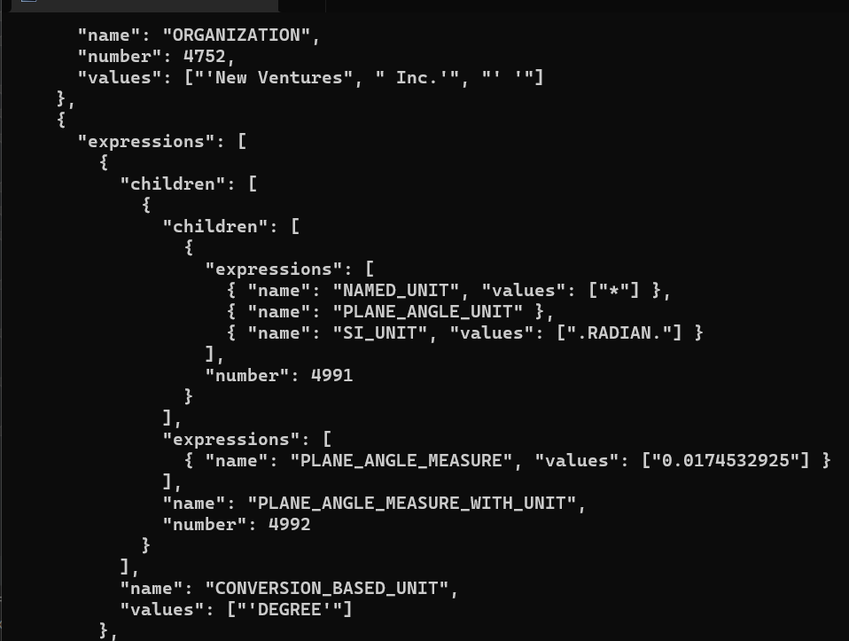

#STEP PARSER

##CLI OPTIONS

* `--input` or `-I` — path to source file 
* `--output` or `-O` — path for output file
* `--show-empty` or `-SE` — show null and empty fields
* `--show-all-numbers` or `-SAN` — show all numbers (not only positive)

## EXAMPLES

### default
```
./step_parser.exe --input ./MBA_N.STP --output ./MBA_N_OUTPUT.json
```



### filter by
#### number
```
./step_parser.exe --input ./MBA_N.STP --output ./MBA_N_OUTPUT.json --filter-by 2309
```
#### name
```
./step_parser.exe --input ./MBA_N.STP --output ./MBA_N_OUTPUT.json --filter-by CC_DESIGN_PERSON_AND_ORGANIZATION_ASSIGNMENT
```

### show empty and all numbers

```
./step_parser.exe --input ./MBA_N.STP --output ./MBA_N_OUTPUT.json --show-empty --show-all-numbers
```